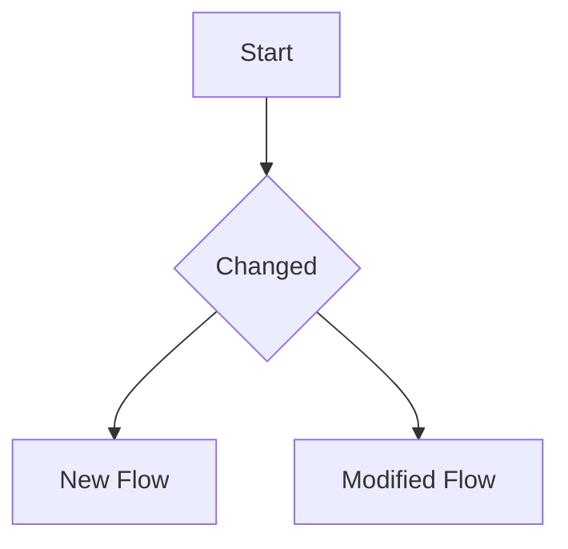
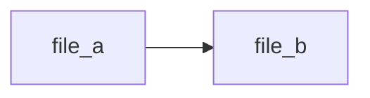
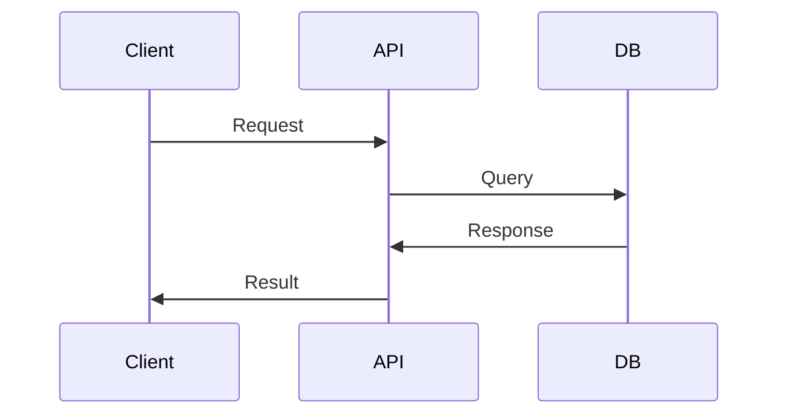

## pr

Use this skill to create or update a Pull Request

## When to use

- When an agent wants to create a PR
- When a subagent wants to create a PR
- When the user is ready to open a PR

### IMPORTANT

- **ALWAYS** use the branch name to build the PR title
- **ALWAYS** generate a diff to build the PR description
- **ALWAYS** include mermaid diagrams:
  1. A flowchart explaining the changes
  2. A diagram showing modified files
  3. A diagram showing the app workflow
- If PR already exists, update it instead of creating a new one

## Instructions

### Step 1: Get branch and repo info

```bash
git branch --show-current
git remote get-url origin
```

### Step 2: Check if PR exists

```bash
gh pr view --json number,title,body --jq '.number' 2>/dev/null || echo "no-pr"
```

### Step 3: Generate the diff

```bash
git diff --stat origin/main...HEAD
git diff origin/main...HEAD
```

### Step 4: Build mermaid diagrams

From the diff, create three mermaid charts:

**CRITICAL — Mermaid GitHub Rendering Rule:**
GitHub's Mermaid renderer does NOT support these characters in node IDs:
- Parentheses `()` — causes "Unable to render rich display" parse error
- Slashes `/` — treated as path separators, breaks node ID
- Dots `.` — causes parse errors
- Hyphens `-` — may work in some contexts but avoid for node IDs
- Spaces and special chars

**Sanitization approach:** Replace ALL special characters with underscores. Keep only alphanumeric + underscore in node IDs. If a file path like `src/routes/(protected)/clinic-management/-index.lazy.tsx` appears in a diagram, it MUST become something like `clinic_mgmt_page` or `index_tsx`.

**Examples of valid sanitization:**
- `src/routes/(protected)/clinic-management/-index.lazy.tsx` → `clinic_mgmt_index` or `clinic_management_page`
- `src/components/organization/organization-form.tsx` → `org_form` or `organization_form`
- `src/orpc/router/clinic.ts` → `clinic_router`
- `prisma/schema.prisma` → `schema_prisma`
- `src/routes/(protected)/-components/sidebar.tsx` → `sidebar`

**1. Changes Flowchart:**

```mermaid
flowchart TD
    %% Build from git diff - inserted/deleted functions and files
    %% Use ONLY alphanumeric + underscore in node IDs
    %% BAD: ClinicPage, clinic-management, organization-form.tsx
    %% GOOD: clinic_page, clinic_mgmt, org_form
```

**2. Modified Files:**

```mermaid
graph TD
    %% List modified files from git diff --stat
    %% Use sanitized IDs - no parentheses, no slashes, no dots
```

**3. App Workflow:**

```mermaid
sequenceDiagram
    %% Show the workflow based on changed files
    %% Use sanitized IDs in participant names
```

### Step 5: Create or update PR

If no PR exists:

```bash
gh pr create --title "BRANCH_NAME" --body "DESCRIPTION_WITH_MERMAID"
```

If PR exists:

```bash
gh pr edit NUMBER --title "BRANCH_NAME" --body "DESCRIPTION_WITH_MERMAID"
```

## PR Body Template

**IMPORTANT**: All node IDs in mermaid diagrams must be sanitized - no parentheses, slashes, dots, or special characters. Use alphanumeric + underscore only.

```markdown
## Summary

<!-- One paragraph summary of changes -->

## Changes Flowchart



## Modified Files



## App Workflow



## Diff

<details>
<summary>Full Diff</summary>

```diff
--DIFF OUTPUT--
```

</details>
```

## Verification

After creating/updating the PR, verify with:

```bash
gh pr view --web
```
